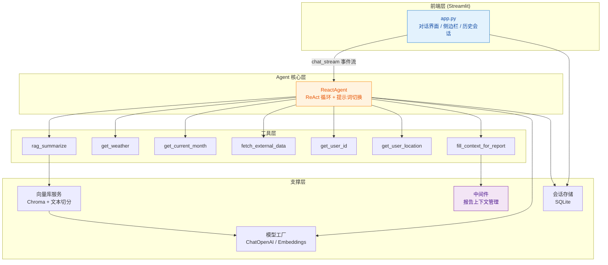
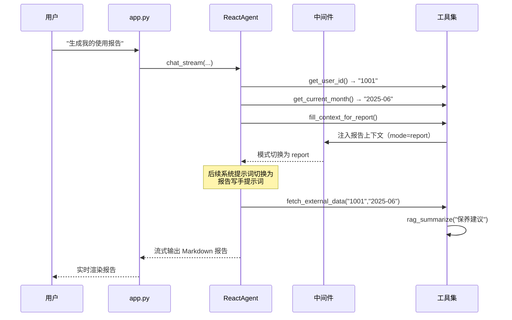

# 🤖 扫地机器人智能客服 Agent

基于 **ReAct 架构** 的扫地/扫拖机器人智能客服系统。融合 **RAG 知识库检索**、**多工具自主调用**、**报告模式提示词切换** 与 **多会话持久化**，提供「Streamlit 可视化 Web 界面 + 可独立调用的 Agent 内核」双入口。

用户可以咨询使用保养、故障排查、天气适配等问题，也可以一句话生成个性化的「个人使用报告」。

---

## ✨ 功能特性

| 特性 | 说明 |
| --- | --- |
| 🧠 **ReAct 思考循环** | 思考 → 调用工具 → 观察结果 → 再思考 → 最终回答，最多迭代 5 轮 |
| 📚 **RAG 知识增强** | Chroma 向量库 + DashScope Embedding，检索扫地机器人专业资料后再回答 |
| 🛠️ **7 个可调用工具** | 知识检索、天气查询、用户身份、月份获取、外部数据、报告上下文注入等 |
| 📊 **双提示词模式** | 普通客服模式 / 报告写手模式，由中间件按用户动态切换 |
| 💬 **多会话持久化** | SQLite 存储，支持新建 / 归档 / 恢复 / 删除历史会话 |
| ⚡ **流式输出** | 模型回答逐字渲染，工具调用过程可折叠查看 |
| 🚀 **惰性加载优化** | 模型、向量库、RAG 服务全部延迟初始化，避免页面加载阻塞 |
| 🔌 **中间件双模式** | 支持「本地函数模式」（同进程）与「HTTP 服务模式」（独立部署） |

---

## 🏗️ 系统架构



### 一次「生成使用报告」的完整链路



---

## 📁 项目结构

```
Agent/
├── app.py                      # Streamlit 主入口（对话界面 + 侧边栏 + 历史会话）
├── verify_tools.py             # 工具运行状态检查脚本（4 层检查）
├── test_session_persist.py     # 会话持久化验证（不依赖模型/RAG）
├── test_react_integration.py   # ReactAgent 集成验证（假模型）
├── test_app_history.py         # Streamlit AppTest 交互流程验证
├── md5.txt                     # 知识库文件 MD5 去重记录（运行时自动生成）
│
├── agent/                      # Agent 核心
│   ├── react_agent.py          # ReAct 主体：思考循环 / 流式输出 / 模式切换
│   └── tools/
│       ├── agents_tools.py     # 工具集定义（无状态 + 有状态闭包工厂）
│       ├── session_store.py    # SQLite 多会话存储 + 旧表自动迁移
│       └── middleware.py       # 报告上下文中间件（本地函数 + HTTP 服务）
│
├── model/
│   └── factory.py              # 模型工厂：ChatOpenAI / DashScopeEmbeddings 惰性单例
│
├── rag/                        # 检索增强
│   ├── rag_service.py          # RAG 总结服务（检索 + 拼上下文 + 模型总结）
│   └── vector_store.py         # 向量库服务（Chroma + 切分 + MD5 去重增量入库）
│
├── utils/                      # 通用工具
│   ├── config_handler.py       # 统一加载 4 个 yml 配置
│   ├── path_tool.py            # 项目绝对路径解析
│   ├── file_handler.py         # MD5 计算 / 文件列举 / PDF·TXT 加载器
│   ├── logger_handler.py       # 日志器（控制台 + 按日切分文件）
│   └── prompt_loader.py        # 提示词加载
│
├── prompts/                    # 提示词模板
│   ├── main_prompt.txt         # 普通客服系统提示词
│   ├── report_prompt.txt       # 报告写手系统提示词
│   └── rag_summarize.txt       # RAG 总结提示词（含 {input} / {context}）
│
├── config/                     # 配置
│   ├── rag.yml                 # 模型名 / embedding 名 / API 端点
│   ├── rag.yml.example         # 配置模板（脱敏，供 clone 后复制）
│   ├── chroma.yml              # 向量库 / 切分 / 数据目录配置
│   ├── agent.yml               # 外部数据路径 / 会话数据库路径
│   └── prompts.yml             # 提示词文件路径
│
├── requirements.txt            # Python 依赖清单
├── .env.example                # 环境变量模板
├── .gitignore                  # Git 忽略规则
├── LICENSE                     # MIT 许可证
│
├── data/                       # 知识库与数据
│   ├── *.txt / *.pdf           # 扫地机器人知识文档
│   ├── external/records.csv    # 用户使用记录（10 用户 × 12 月）
│   └── sessions.db             # SQLite 会话库（运行时生成）
│
├── chroma_db/                  # Chroma 持久化目录（运行时生成）
└── logs/                       # 运行日志（运行时生成）
```

---

## 🚀 快速开始

### 1. 环境要求

- Python **3.10+**（推荐 3.11）
- 可访问大模型 API 的网络环境
- 可选：DashScope（阿里云百炼）API Key —— 用于 Embedding

### 2. 安装依赖

```bash
pip install streamlit langchain langchain-core langchain-openai langchain-community \
            langchain-chroma langchain-text-splitters chromadb pyyaml pypdf
```

### 3. 配置

复制配置模板并填入你的真实信息：

```bash
cp config/rag.yml.example config/rag.local.yml
```

编辑 `config/rag.local.yml`：

```yaml
chat_model_name: qwen-max            # 对话模型名（按所用服务商填写）
embedding_model_name: text-embedding-v3
api_base: "https://your-endpoint/v1" # 留空则走 OpenAI 官方默认
```

> 也可以直接编辑 `config/rag.yml`（仓库内的默认值即为无端点配置）。

设置密钥环境变量：

```bash
# Windows (PowerShell)
$env:OPENAI_API_KEY = "sk-xxxxxxxx"

# Linux / macOS
export OPENAI_API_KEY="sk-xxxxxxxx"

# Embedding 使用 DashScope 时需要
export DASHSCOPE_API_KEY="sk-xxxxxxxx"
```

> **API 端点优先级**：`config/rag.yml` 的 `api_base` > 环境变量 `OPENAI_API_BASE` > `OPENAI_BASE_URL` > OpenAI 官方默认。

### 4. 构建知识库（首次运行）

将知识文档（`.txt` / `.pdf`）放入 `data/` 目录，然后执行：

```bash
python rag/vector_store.py
```

程序会遍历 `data/` 下所有允许类型的文件，按 MD5 去重后切分入库。重复执行不会重复写入。

> 调整切分参数请编辑 `config/chroma.yml` 的 `chunk_size` / `chunk_overlap` / `separators`。
> 若需重新入库，删除 `md5.txt` 与 `chroma_db/` 后重跑即可。

### 5. 启动应用

```bash
streamlit run app.py
```

浏览器会自动打开 `http://localhost:8501`。

---

## 💡 使用方式

### 界面操作

| 区域 | 功能 |
| --- | --- |
| **用户 ID** | 隔离不同用户的历史会话与使用记录（默认 `1001`） |
| **所在城市** | 用于天气查询与地域适配 |
| **中间件设置** | 切换「本地函数」/「HTTP 服务」模式 |
| **模式指示器** | 实时显示当前是 💬 普通模式 还是 📊 报告模式 |
| **🆕 新对话** | 归档当前会话并开始新会话（历史记录保留） |
| **📚 历史会话** | 点击可恢复全部对话并继续；🗑 可删除 |

### 示例提问

```
扫地机器人每天用合适吗？
深圳最近天气潮湿，对扫地机器人有影响吗？
扫地机器人边刷不转了怎么排查？
生成我的使用报告
生成我 2025 年 6 月的使用报告
```

### HTTP 中间件模式（可选）

若需将中间件独立部署：

```bash
python agent/tools/middleware.py
# 服务启动于 http://127.0.0.1:8000
```

然后在 Streamlit 侧边栏选择「HTTP 服务」并填写地址。

**中间件接口：**

| 方法 | 路径 | 说明 |
| --- | --- | --- |
| `POST` | `/context/fill` | 注入报告上下文，body: `{"user_id": "1001"}` |
| `GET` | `/context/get?user_id=1001` | 查询用户当前上下文 |
| `POST` | `/context/clear` | 清理上下文，恢复普通模式 |
| `GET` | `/health` | 健康检查 |

---

## 🧩 工具清单

| 工具名 | 入参 | 说明 |
| --- | --- | --- |
| `rag_summarize` | `query: str` | 从向量库检索扫地机器人专业资料并总结（结果缓存 10 分钟） |
| `get_weather` | `city: str` | 调用 wttr.in 免费 API 获取实时天气（结果缓存 30 分钟） |
| `get_current_month` | — | 返回当前月份，格式 `YYYY-MM` |
| `fetch_external_data` | `user_id, month` | 查询指定用户指定月份的使用记录 |
| `get_user_location` | — | 返回当前用户所在城市（闭包注入） |
| `get_user_id` | — | 返回当前用户 ID（闭包注入） |
| `fill_context_for_report` | — | 触发中间件注入报告上下文，实现提示词切换 |

---

## 🧪 测试与自检

```bash
# 工具运行状态检查（语法 / 导入 / 工具调用 / 模型配置，共 4 层）
python verify_tools.py

# 会话持久化验证（含旧表迁移，不依赖模型与向量库）
python test_session_persist.py

# ReactAgent 集成验证（使用假模型，不消耗 API 额度）
python test_react_integration.py

# Streamlit 交互流程验证（空状态 / 历史加载 / 新对话）
python test_app_history.py
```

所有脚本均以退出码表示结果（`0` 通过 / `1` 失败），可直接接入 CI。

---

## ⚙️ 配置说明

<details>
<summary><b>config/rag.yml</b></summary>

```yaml
chat_model_name: qwen-max                       # 对话模型名称
embedding_model_name: text-embedding-v3         # Embedding 模型名称
api_base: ""                                    # API 端点（留空走环境变量或官方）
```

> `config/rag.yml.example` 为模板文件；含真实端点的本地配置建议放在 `config/rag.local.yml`（已 gitignore）。
</details>

<details>
<summary><b>config/chroma.yml</b></summary>

```yaml
collection_name: agent                          # 向量库集合名
persist_directory: chroma_db                    # 持久化目录
k: 3                                            # 检索返回条数
data_path: data                                 # 知识文档目录
md5_hex_store: md5.txt                          # MD5 去重记录文件
allow_knowledge_file_type: ["txt", "pdf"]       # 允许的文件类型
chunk_size: 200                                 # 分片长度
chunk_overlap: 20                               # 分片重叠
separators: ["\n\n", "。", ".", "?", "？", "!", " ", ""]
```
</details>

<details>
<summary><b>config/agent.yml</b></summary>

```yaml
external_data_path: data/external/records.csv   # 用户使用记录 CSV
session_db_path: data/sessions.db               # 会话数据库路径
```
</details>

<details>
<summary><b>config/prompts.yml</b></summary>

```yaml
main_prompt_path: prompts/main_prompt.txt           # 普通客服提示词
rag_summarize_prompt_path: prompts/rag_summarize.txt # RAG 总结提示词
report_prompt_path: prompts/report_prompt.txt       # 报告写手提示词
```
</details>

---

## 🔍 关键设计说明

### 报告模式切换机制

报告生成不是硬编码的分支逻辑，而是由 **模型自主判断 + 中间件状态管理** 协同完成：

1. 提示词中强约束：判断用户意图为「生成报告」时，必须先调用 `fill_context_for_report`；
2. `ReactAgent` 检测到该工具名被调用 → 调用中间件 `fill_context(user_id)`，用户模式置为 `report`；
3. 下一轮循环组装消息时，`_get_system_prompt()` 读取模式并返回 **报告写手提示词**；
4. 报告生成完毕可调用 `agent.finish_report(user_id, conversation_id)` 恢复普通模式。

这种设计把「模式状态」外置到中间件，Agent 本身保持无状态倾向，便于横向扩展与独立部署。

### 多会话模型

会话有两种状态：

- **active** —— 进行中，不出现在历史列表
- **archived** —— 已归档，出现在历史列表

```
打开网站  → archive_all_active() → create_conversation() → 空状态
点击新对话 → archive_conversation(当前) → create_conversation() → 空状态
点击历史   → archive_conversation(当前) → reactivate_conversation(目标) → 加载全部消息
```

空会话（无任何消息）在归档时直接删除，避免历史列表堆积无意义记录。
旧版单会话表（`sessions` / `messages`）在首次初始化时自动迁移为归档会话并删除旧表。

### 惰性加载

实测数据：`langchain_chroma` 导入约 **12 秒**，RAG 服务初始化约 **28 秒**，`langchain_openai` 导入约 **7.5 秒**，ChatModel 创建约 **3-4 秒**。

若在模块 import 阶段完成这些初始化，网页首屏会长时间白屏。因此项目中：

- `model/factory.py` —— `get_chat_model()` / `get_embed_model()` 首次调用时才创建
- `agent/tools/agents_tools.py` —— RAG 服务在首次调用 `rag_summarize` 时才延迟 import 并初始化
- `app.py` —— 用 `@st.cache_resource` 缓存 `ReactAgent` 实例，避免每次 rerun 重建

---

## 📝 数据格式

`data/external/records.csv` 为合成测试数据，覆盖 10 个用户（`1001`–`1010`）× 12 个月（`2025-01` ~ `2025-12`）：

```csv
"用户ID","特征","清洁效率","耗材","对比","时间"
"1001","养猫","95.2%","边刷轻微磨损","较上月提升3%","2025-01"
```

---

## ⚠️ 注意事项

1. **API Key 安全**：密钥一律通过环境变量注入，不要写入配置文件。仓库中仅保留 `config/rag.yml.example` 模板；本地真实配置请放在 `config/rag.local.yml`（已被 `.gitignore` 忽略）。
2. **知识库首次构建**：首次运行必须执行 `python rag/vector_store.py`，否则 `rag_summarize` 检索为空。
3. **天气工具**：依赖 `wttr.in` 公网服务，网络不通时返回兜底文案，不影响主流程。
4. **外部数据热更新**：`data/external/records.csv` 按文件 `mtime` 判断是否需要重新加载，修改 CSV 后**无需重启进程**，下次调用自动生效。
5. **会话缓存**：`ReactAgent` 内存中的 `sessions` 与 SQLite 双写，进程重启后从 SQLite 恢复完整历史。

---

## 📄 License

本项目仅用于学习与演示目的。
